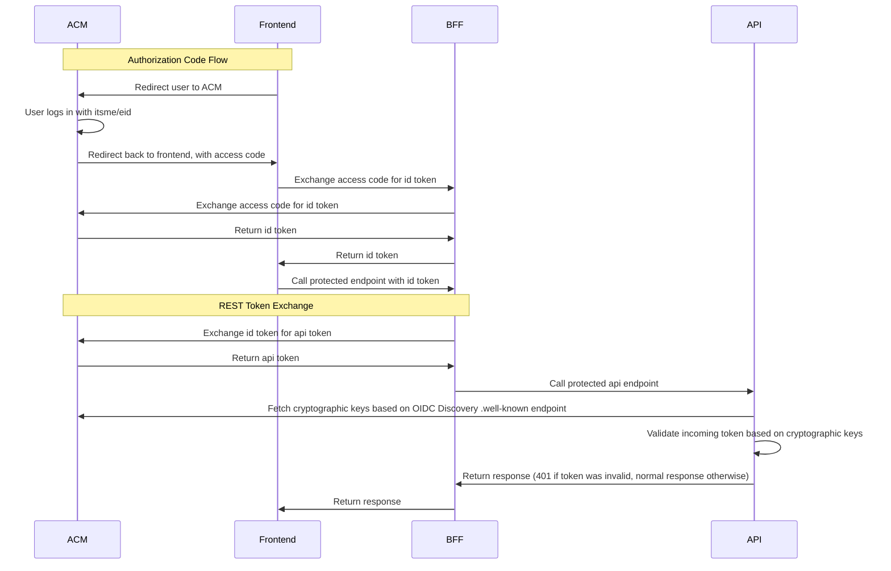

## ACM TEST
This repo contains sample code to fetch jwt's from [ACM](https://authenticatie.vlaanderen.be/docs/) according to the OAuth2.0 / OpenId Connect standards and can be used to test if your ACM configuration is correct.

The app uses below flow to log in a user and to exchange its token for an api token:

https://mermaid.live

## Getting started
1. Make a copy of `appsettings.json` and name it `appsettings.secrets.json`. 
2. `acmLoginUrl` and `acmTokenEndpoint` are set to the TI environment (test and integration) of ACM. If you want to call production ACM, replace this values with their respective Production equivalents (see [discovery URL](https://authenticatie.vlaanderen.be/docs/beveiligen-van-toepassingen/integratie-methoden/oidc/technische-info/discovery-url/)).
3. Fill in the values for `frontendClientId`,`frontendClientSecret`,`frontendRedirectUri`,`frontendScopes`, `apiClientId`. You should have gotten these after filling in an "integration dossier" with the [Flanders ACM integration Team](https://authenticatie.vlaanderen.be/docs/beveiligen-van-toepassingen/integratie-methoden/oidc/integratieproces/). 
4. You're all set.
5. If things are not working as they should, it's likely there's is some ACM configuration that's not 100% correct. Contact the Flanders ACM integration team.

## Notes
* In a normal authorization code flow with pkce scenario, the frontend client exchanges the access code for an id token. However in the flow depicted above, the BFF exchanges the access code for an id token instead. This is because ACM requires a client_secret to be passed with this step and the frontend client can not be trusted with this secret since it's easily discoverable. Hence we make this call from the BFF. Yes, PKCE is a bit useless because of this. 
* If the API needs to call another API that is secured with ACM, check out the [client credentials flow](https://authenticatie.vlaanderen.be/docs/beveiligen-van-api/oauth-rest/rest-server2server).

## Links
* Authorization Code Flow https://authenticatie.vlaanderen.be/docs/beveiligen-van-toepassingen/integratie-methoden/oidc/technische-info/flow/#authorization-code-flow
* PKCE https://authenticatie.vlaanderen.be/docs/beveiligen-van-toepassingen/integratie-methoden/oidc/technische-info/pkce/
* REST Token Exchange https://authenticatie.vlaanderen.be/docs/beveiligen-van-api/oauth-rest/rest-namens-gebruiker/rest-token-exchange/
* Discovery URL https://authenticatie.vlaanderen.be/docs/beveiligen-van-toepassingen/integratie-methoden/oidc/technische-info/discovery-url/
* Client Credentials flow (api to api communication): https://authenticatie.vlaanderen.be/docs/beveiligen-van-api/oauth-rest/rest-server2server/
